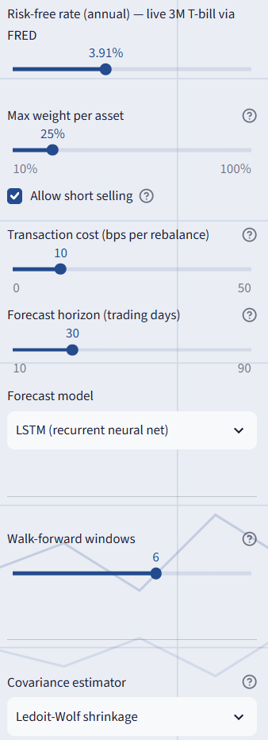
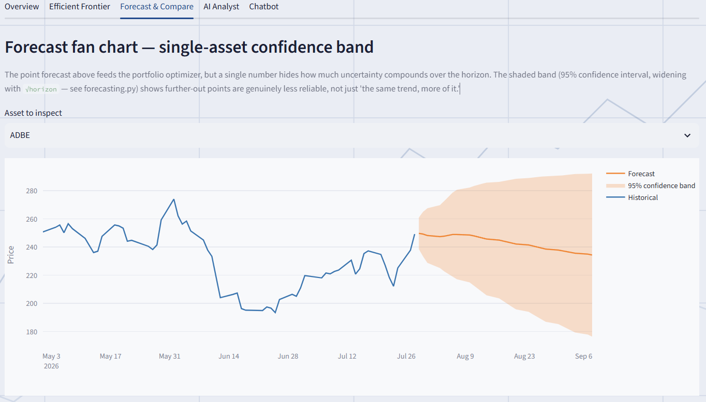
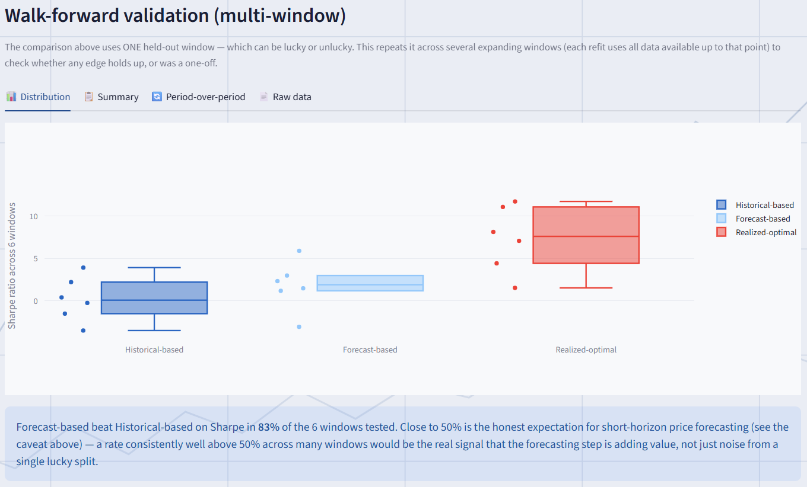

# Screenshots

Rendered at a fixed width below (via HTML ``, not plain Markdown ``) so every screenshot
lines up consistently regardless of its original crop/resolution — plain Markdown image syntax
renders each one at its native size, which is what made narrower column crops look misaligned
against the rest on GitHub.

**Overview — Macro & Risk context**

**Overview — Prices & Analytics**

**Overview — Time-series diagnostics**

**Overview — Fundamentals**

**Sidebar — key controls & forecast model selector**
<table><tr>
<td></td>
<td></td>
</tr></table>

**Efficient Frontier — with optimal weights**
<table><tr>
<td></td>
<td></td>
</tr></table>

**Efficient Frontier — Fama-French factor exposure**

**Forecast & Compare — the three-portfolio comparison**

**Forecast & Compare — single-asset confidence band**

**Walk-forward validation — period-over-period**

**AI Analyst — commentary & news digest**

**AI Analyst — sentiment by ticker**

**AI Analyst — sources**

**Chatbot — academic literature search**

**Chatbot — grounded Q&A**

